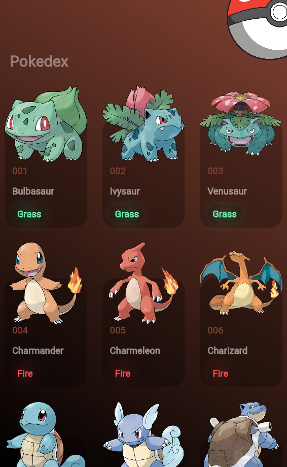

# Pokedex Flutter App

Una aplicación móvil de Pokedex desarrollada con Flutter que muestra información de Pokémon obtenida a través de una API.



## Descripción

Esta aplicación es una Pokedex que permite a los usuarios explorar una lista de Pokémon. Cada Pokémon se muestra en una tarjeta con su número, nombre, tipo principal y una imagen oficial. La interfaz de usuario está diseñada con una estética temática de Pokémon.

## Características

- **Interfaz de usuario atractiva**: Diseño temático de Pokémon con fondo personalizado
- **Lista de Pokémon**: Muestra todos los Pokémon en un grid responsive
- **Tarjetas de Pokémon**: Cada tarjeta muestra:
  - Número de Pokémon
  - Nombre
  - Tipo principal
  - Imagen oficial del Pokémon
- **Manejo de carga**: Indicadores de carga durante la obtención de datos e imágenes
- **Manejo de errores**: Imágenes de respaldo cuando hay problemas al cargar

## Estructura del Proyecto

    ```plaintext
    lib/
    ├── main.dart
    ├── pages/
    │   └── home.dart
    └── widgets/
        ├── app_theme.dart
        ├── pokeapi.dart
        ├── pokemon_card.dart
        └── pokemon_colors.dart
    assets/
    └── pokeball.png
    ```

## Componentes Principales

### HomePage

La página principal que muestra la lista de Pokémon en un grid. Gestiona el estado de carga y la presentación de los datos.

### PokeApiService

Servicio encargado de realizar peticiones HTTP para obtener datos de la API de Pokémon. Procesa la respuesta JSON y prepara los datos para su visualización.

### PokemonCard

Widget reutilizable que representa cada tarjeta de Pokémon individual, mostrando su información e imagen.

### AppTheme

Contiene los estilos y temas visuales utilizados en toda la aplicación.

## API

La aplicación utiliza dos fuentes de datos complementarias:
- **Datos básicos**: Obtenidos de `raw.githubusercontent.com/Biuni/PokemonGO-Pokedex/master/pokedex.json`
- **Imágenes oficiales**: Obtenidas de `raw.githubusercontent.com/PokeAPI/sprites/master/sprites/pokemon/other/official-artwork/`

## Dependencias

- `http`: Para realizar peticiones HTTP a la API de Pokémon

## Instalación

1. Clona este repositorio:
   ```bash
   git clone https://https://github.com/Oliver-92/pokedex_flutter.git
   ```

2. Navega a la carpeta del proyecto:
   ```bash
   cd flutter_app_05_pokeapi
   ```

3. Instala las dependencias:
   ```bash
   flutter pub get
   ```

4. Ejecuta la aplicación:
   ```bash
   flutter run
   ```

## Futuras Mejoras

- Implementar búsqueda de Pokémon
- Añadir pantalla de detalle para cada Pokémon
- Filtrar por tipo de Pokémon
- Implementar modo oscuro/claro
- Agregar favoritos y almacenamiento local
- Mejorar la gestión de errores


